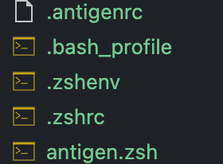

# zsh_quick_apply

## Copy fiels in directory `settings` to your home dir.

Run: `zsh`. 
That's all.

If somethins wrong? 

## First check if installed Zsh in your computer

- `which zsh`
- Or, `cat /etc/shells`

1. If zsh not found, you should install `zsh` on your computer.

On Mac: brew install zsh
On Linux: yum(or apt-get) install zsh
Build from source: 
  - `wget https://sourceforge.net/projects/zsh/files/zsh/5.9/zsh-5.9.tar.xz`
    - or manually download from [zsh](https://zsh.sourceforge.io/Arc/source.html)
  - Unzip the file, run `tar -xvf zsh-5.9.tar.xz`
  - Building
    - `./configure --prefix=path-to-install`
    - `make -j && make install`
  - Add the zsh install path `path-to-install/bin` to PATH, i.e., in ~/.bashrc, `export PATH=path-to-install/bin:$PATH`

Check: run `zsh --version`

2. Make it your default shell: `chsh -s $(which zsh)`

More info, see [zsh install](https://github.com/ohmyzsh/ohmyzsh/wiki/Installing-ZSH)

## Check if installed `autojump`

Install it.

## Zsh themes
https://github.com/ohmyzsh/ohmyzsh/wiki/Themes

## Zsh Usage

- [zsh 快捷键让shell 命令效率飞起 - 掘金](https://juejin.cn/post/6844903849572974605)
 加粗常用
`⌃` 表示control键(windows)，win键(mac)
**⌃ + u：清空当前行**

**⌃ + a：移动到行首**

**⌃ + e：移动到行尾**

⌃ + f：向前移动

⌃ + b：向后移动

**⌃ + p：上一条命令**

**⌃ + n：下一条命令**

⌃ + r：搜索历史命令

⌃ + y：召回最近用命令删除的文字

⌃ + h：删除光标之前的字符

⌃ + d：删除光标所指的字符

**⌃ + w：删除光标之前的单词**

**⌃ + k：删除从光标到行尾的内容**

⌃ + t：交换光标和之前的字符

- [Terminal - 快捷键相关操作 - 思维风暴](https://tkstorm.com/posts-list/os/linux/terminal-tips/)

# 中文
1. 首先确认主机是否有安装zsh，
- `which zsh`
- Or, `cat /etc/shells`

如果没有，则进行安装
- On Mac: brew install zsh
- On Linux: yum(or apt-get) install zsh
Build from source: 
● wget https://sourceforge.net/projects/zsh/files/zsh/5.9/zsh-5.9.tar.xz
  ○ or manually download from zsh
● Unzip the file, run tar -xvf zsh-5.9.tar.xz
● Building
  ○ ./configure --prefix=path-to-install
  ○ make -j && make install
● Add the zsh install path path-to-install/bin to PATH, i.e., in ~/.bashrc, export PATH=path-to-install/bin:$PATH

- Check: run zsh --version

1. 然后把附件中文件复制到个人目录下（cd ~）
  a. 注意包含隐藏文件，
  b. 可以通过命令，`mv zsh_quick_apply/.[^.]* zsh_quick_apply/* ~`
1. 终端上运行一下zsh命令，查看效果是否正确，如，
2. Make zsh your default shell: `chsh -s $(which zsh)`
3. VS Code选择默认终端为zsh，
  a. VScode设置json中，增加："terminal.integrated.defaultProfile.linux": "zsh",